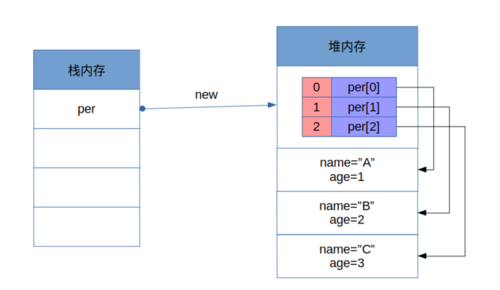
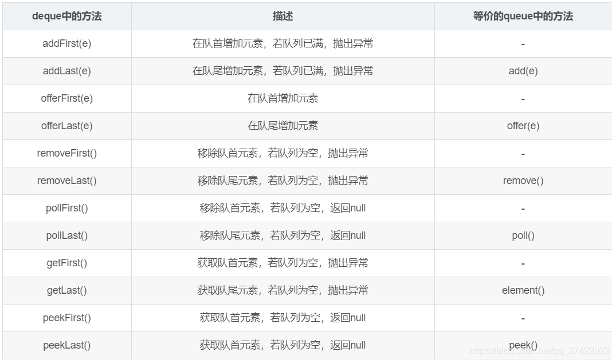
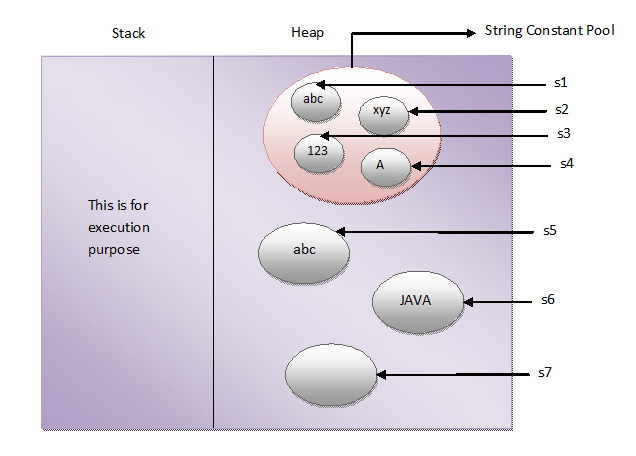

## Java对象内存

Integer对象24字节：16对象开销+4int值开销+4填充字节

Date对象32字节：16对象开销+4*3int值年月日开销+4填充字节

Node对象40字节：16对象开销+8Item对象引用开销+8Node对象引用开销+8外部类对象引用开销

int数组24+4N字节：16对象开销+4int指表示长度+4填充字节+4*N对象成员开销

对象数组24+8N+32N：16对象开销+4int值表示长度+4填充字节+8*N对象引用+32*NDate对象内存

String对象40字节

## 线性表

线性表是零个或多个数据元素的有限序列

### 顺序存储结构

#### java中的数组

- 线性数组
- 循环数组



#### **java中的ArrayList**

ArrayList为可变长度数组，内部维护一个定长数组，增长时调用Array的copy方法，原理为新建空数组后复制，具体的System.arraycopy为native方法。

```java
// ArrayList
private void grow(int minCapacity) {
    // overflow-conscious code
    int oldCapacity = elementData.length;
    int newCapacity = oldCapacity + (oldCapacity >> 1);
    if (newCapacity - minCapacity < 0)
        newCapacity = minCapacity;
    if (newCapacity - MAX_ARRAY_SIZE > 0)
        newCapacity = hugeCapacity(minCapacity);
    // minCapacity is usually close to size, so this is a win:
    elementData = Arrays.copyOf(elementData, newCapacity);
}
// Array
public static <T,U> T[] copyOf(U[] original, int newLength, Class<? extends T[]> newType) {
    @SuppressWarnings("unchecked")
    T[] copy = ((Object)newType == (Object)Object[].class)
        ? (T[]) new Object[newLength]
        : (T[]) Array.newInstance(newType.getComponentType(), newLength);
    System.arraycopy(original, 0, copy, 0,
                     Math.min(original.length, newLength));
    return copy;
}
```

源码中内部维护的数组的定义格式：

```java
transient Object[] elementData; // non-private to simplify nested class access
```

- 无private 是为了简化内部类的访问，又private时，外部类其实是为private域创造了一个方法来供内部类调用，这会影响其迭代器的速度。

- 使用transient是为了自定义序列化过程，`ArrayList`在序列化的时候会调用`writeObject`，直接将`size`和`element`写入`ObjectOutputStream`；反序列化时调用`readObject`，从`ObjectInputStream`获取`size`和`element`，再恢复到`elementData`。

  ```java
   /** Classes that require special handling during the serialization and
   * deserialization process must implement special methods with these exact
   * signatures:
   *
   * <PRE>
   * private void writeObject(java.io.ObjectOutputStream out)
   *     throws IOException
   * private void readObject(java.io.ObjectInputStream in)
   *     throws IOException, ClassNotFoundException;
   * private void readObjectNoData()
   *     throws ObjectStreamException;
   * </PRE> 
   ** /
  ```

  为什么不直接用`elementData`来序列化，而采用上诉的方式来实现序列化呢？原因在于`elementData`是一个缓存数组，它通常会预留一些容量，等容量不足时再扩充容量，那么有些空间可能就没有实际存储元素，采用上诉的方式来实现序列化时，就可以保证只序列化实际存储的那些元素，而不是整个数组，从而节省空间和时间。

#### java中的Vector

Vector继承了AbstractList，实现了List, RandomAccess, Cloneable, java.io.Serializable，和ArrayList一致

Vector大致与ArrayList一致，但是有以下几点区别

- 初始化

  默认无参构造方法 Vector会初始化一个长度为10的数组，ArrayList在具体调用时再创建数组。
  比较之下，ArrayList延迟化加载更节省空间

- 扩容 (grow())
  Vector当增量为0时，扩充为原来大小的2倍，当增量大于0时，扩充为原来大小加增量 ArrayList扩充算法：原来数组大小加原来数组的一半

  为什么Vector选择了较为浪费空间的方式扩容，我相信C++ Vector和Java Vector的该处原理应该一致，https://www.zhihu.com/question/36538542/answer/67929747

- 线程安全

  Vector是线程安全的，ArrayList是非线程安全的

  Vector的线程安全包括其内部类如迭代器实现类ListItr

其实最大的区别就是线程安全性，当然如果我们想创建一个线程安全的ArrayList，可以调用Collections.synchronizedList()，得到静态内部类SynchronizedList，利用同步代码块处理ArrayList。

这种方式得到的线程安全的ArrayList和Vector有什么区别？很简单，一是同步代码块和同步方法的区别，剩下的是ArrayList和Vector除了线程安全性的其他区别；还有一点不能忽略，**前者的迭代器的同步实现需要使用者手动控制**

```java
public ListIterator<E> listIterator() {
     return list.listIterator(); // Must be manually synched by user
}
```

这是SynchronizedList的迭代器获取

不过Collections.synchronizedList()的入参是List类型，可以传入List的其他实现类如LinkedList

### 链式存储结构

- 单链表
- 静态链表：使用数组实现链表
- 循环链表
- 双向链表

#### java中的LinkedList

java使用内部类完成LinkedList，同时实现双向队列

```java
private static class Node<E> {
    E item;
    Node<E> next;
    Node<E> prev;

    Node(Node<E> prev, E element, Node<E> next) {
        this.item = element;
        this.next = next;
        this.prev = prev;
    }
}
```

### 栈和队列

栈Stack是限定仅在表尾进行插入和删除操作的线性表

- 可以使用顺序存储结构实现，如ArrayDeque
- 也可以使用链式存储结构实现，如LinkedList。

> 基于数组的栈是在数组尾部进行入栈和出栈操作，因此实现复杂度为O（1）；
>
> 基于链表的栈是在链表头部进行入栈和出栈操作，因此实现复杂度也为O（1）；
>
> 因此两者的性能不会差很多，在opCnt=1000 0000时，arrayStack的性能比linkedStack性能要好。原因是linkedStack要进行大量的new操作，在opCnt较小的情况下，体现不出性能差异；而在操作次数大时，arrayStack性能优势就体现出来了。
>
> 当前这种性能的比较还是比较粗糙的，但是也能粗略的反映问题。

队列是只允许在一端进行插入操作，在另一段进行删除操作的线性表

- 循环队列，ArrayDeque
- 链表队列，LinkedList

#### java中的queue与deque



其中后面四组get操作操作不会删除队列中的元素。

offer、poll、peek三个术语不会抛出异常，add、remove、element（get）三个术语会抛出异常。

#### java中的PriorityQueue

PriorityQueue内部维护一个数组，是小顶堆

#### java中的ArrayDeque

```java
/** This class is likely to be faster than
 * {@link Stack} when used as a stack, and faster than {@link LinkedList}
 * when used as a queue.
 **/
```

ArrayDeque内部维护一个数组，默认大小为16，扩容方式为倍增，循环数组解决Copy问题


## 串

- 串String是由0个或多个字符组成的有限序列。
- 串的比较是通过组成串的字符之间的编码进行的
- 分为顺序存储结构和链式存储结构

### java中的String

- String是值不可变(immutable)的常量，是线程安全的(can be shared)。      
- String类使用了final修饰符，表明了String类的第二个特点：String类是不可继承的。

- 内存模型

  在java中，内存分成两个区域stack 和 heap , stack 用于运行（包括变量引用和逻辑运行），heap 用于存储变量实体。java中对String对象特殊对待，所以在heap区域分成了两块，一块是String constant pool,用于存储java字符串常量对象，另一块用于存储普通对象及字符串对象。

  而string的创建有两种方法：String a = "abc"; String b=new String("abc");

  对于第一种，jvm会首先在String constant pool 中寻找是否已经存在"abc"常量，如果没有则创建该常量,并且将此常量的引用返回给String a;如果已有"abc" 常量，则直接返回String constant pool 中“abc” 的引用给String a.此创建方法之会在String constant pool中创建对象。

  对于第二种，jvm会直接在非String constant pool 中创建字符串对象，并不会把"abc” 加入到String constant pool中，并把该对象 引用返回给String b;

  如果创建字符串代码如下：

  ```java
  String s1 = "abc"; 
  String s2 = "xyz"; 
  String s3 = "123"; 
  String s4 = "A"; 
  String s5 = newString("abc"); 
  char[] c = {'J','A','V','A'}; 
  String s6 = newString(c); 
  String s7 = newString(newStringBuffer());
  ```

  字符串在内存中的存储情况如下图所示：

  
  
  One more interesting thing about String Constant Pool is that, **pool space is allocated to an object depending upon it’s content**. There will be no two objects in the pool having the same content.
  
  This is what happens when you create string objects using string literal,
  
  **“When you create a string object using string literal, JVM first checks the content of to be created object. If there exist an object in the pool with the same content, then it returns the reference of that object. It doesn’t create new object. If the content is different from the existing objects then only it creates new object.”**
  
  But, when you create string objects using new keyword, a new object is created whether the content is same or not.
  
  ```java
  public class StringExamples
  {
      public static void main(String[] args)
      {
          //Creating string objects using literals
          String s1 = "abc";
          String s2 = "abc";
          System.out.println(s1 == s2);        //Output : true
   
          //Creating string objects using new operator
          String s3 = new String("abc");
          String s4 = new String("abc");
          System.out.println(s3 == s4);        //Output : false
      }
  }
  ```
  
  虽然new String()方法并不会把"abc” 加入到String constant pool中，但是可以手动调用String.intern(),将new 出来的字符串对象加入到String constant pool中。
  
  ```java
  public void testString() {
  
      String s1 = new String("abc");
      String s2 = "abc";
      System.out.println(s1 == s2);        //Output : false
  
      String s3 = new String("def");
      String s4 = s3.intern();
      String s6 = "de" + "f";
      System.out.println(s3 == s5);        //Output : false
      System.out.println(s4 == s5);        //Output : true
      System.out.println(s6 == s5);        //Output : true
  }
  ```

- String的不可变性会被反射打破

  ```java
  public static void testReflection() throws Exception {
      //创建字符串"Hello World"， 并赋给引用s
      String s = "Hello World";
      System.out.println("s = " + s);
      System.out.println("s.add = " + s.hashCode()); 
      
      //获取String类中的value字段
      Field valueFieldOfString = String.class.getDeclaredField("value");
      valueFieldOfString.setAccessible(true);
      
      //获取s对象上的value属性的值
      char[] value = (char[]) valueFieldOfString.get(s);
      value[5] = '_';
      System.out.println("s = " + s); 
      System.out.println("s.add = " + s.hashCode()); 
  } /*
  s = Hello World
  s.add = -862545276
  s = Hello_World
  s.add = -862545276 */
  ```

  在这个过程中，s始终引用的同一个String对象，但是再反射前后，这个String对象发生了变化， 也就是说，通过反射是可以修改所谓的“不可变”对象的。但是一般我们不这么做。这个反射的实例还可以说明一个问题：如果一个对象，他组合的其他对象的状态是可以改变的，那么这个对象很可能不是不可变对象。例如一个Car对象，它组合了一个Wheel对象，虽然这个Wheel对象声明成了private final 的，但是这个Wheel对象内部的状态可以改变， 那么就不能很好的保证Car对象不可变。

### 串的匹配

#### 朴素的模式匹配算法

就是遍历呗，最坏复杂度为O((n-m+1)*m)

#### KPM模式匹配算法

去掉长串的回溯部分，算法复杂度为O(m+n)


## 树

- 节点拥有子树的数量称为**节点的度**，最大的节点度为**树的度**
- 根节点、内部节点、叶子节点
- 节点的层次、树的深度
- 有序树、无序树
- 森林

### 二叉树

- 满二叉树、完全二叉树（数组放满）、平衡二叉树（左右子树高度相差一，且排序）
- 二叉树可以用顺序存储结构、也可以使用链表存储结构

## 查找

- 静态查找表、动态查找表

### 顺序表查找

- 顺序查找

  ```java
  for (int i = 0; i <= n; i++) {
      if (a[i] == key) {
          return i;
      }
  }
  ```

- 设置哨兵优化

  ```java
  a[n] = key;
  int i = 0;
  while (a[i] != key)
  	i++
  return i == n ? -1, i;
  ```

### 有序表查找

- 折半查找

  ```java
  private static <T> 
  int indexdBinarySearch(List<? extends Comparable<? super T>> list, T key) {
  	int low = 0;
  	int high = list.size() - 1;
  	while (low <= high) {
  		int mid = (low + high) >>> 1;
  		Comparable<? super T> midVal = list.get(mid);
  		int cmp = midVal.compareTo(key);
  		
  		if (cmp < 0) low = mid + 1;
  		else if (cmp > 0) high = mid - 1;
  		else return mid;
  	}
  	return -(low + 1);
  }
  ```

- 插值查找

  适合于表长较大，且数据分布均匀的查找表

- 斐波那契查找

  评价性能优于折半查找

### 线性索引查找

索引就是把关键字和它对应的记录相关联的过程

- 稠密索引，数据集的每一个数据项对应一个索引项，因此索引项会很大，这时为了快速找到索引项，需要将索引项排序，用折半查找等方式查找索引项；然而对内存有限的计算机来说，可能就需要反复访问磁盘，查找性能大大下降

- 分块索引，块内无序，块间有序。因此需要一个块索引表，包含块的最大关键码、块中的记录个数、块的开始地址
- 倒排索引，由属性查找记录而不是由记录查找属性

### 二叉排序树

一种动态查找表，又叫二叉查找树，左子树小于根节点、右子树大于根节点，二叉排序树采用链式结构存储，插入删除的时间性能比较好，但是查找性能不稳定


## 排序

### 排序的分类

- 排序的稳定性，两个相等的元素排序前后的相对位置保持一致，则称排序是稳定的

- 内排序和外排序

  内排序指所有记录全被放置在内存中

  - 性能受三个方面影响
    - 时间性能，主要涉及比较和记录的移动
    - 辅助空间，除数据本身的辅助空间
    - 算法的复杂性
  - 典型算法
    - 插入排序
    - 交换排序
    - 选择排序
    - 瑰宝排序

  外排序指排序过程中，需要内外内存之间多次交换数据

### 冒泡排序

两两比较相邻记录的关键字，如果反序则交换，直到没有反序为止。

两层for循环，第一轮使第一个元素最小，第二轮使第二个元素第二小

最好时间O(n)，最坏时间O(n^2)，平均时间O(n^2)，额外空间为1，稳定

### 选择排序

比较n轮，每次选出最小元素，然后和前面的元素交换

与冒泡排序相比，交换次数下降，因为算法性能有提升

最好时间O(n)，最坏时间O(n^2)，平均时间O(n^2)，额外空间为1，不稳定

### 插入排序

n轮，每轮将第n个元素插入到合适的位置

性能优于冒泡排序和选择排序

### 希尔排序

基于h有序数组，是多个插入排序的组合，效率更高

### 归并排序

### 快速排序

- 快速排序的内循环用一个递增的索引将数组元素与一个定值比较，次内循环很短小，归并排序和希尔排序一般都比快速排序要慢，因为它们还要在内循环中移动数据
- 快速排序的另一个优势是其比较次数很少


